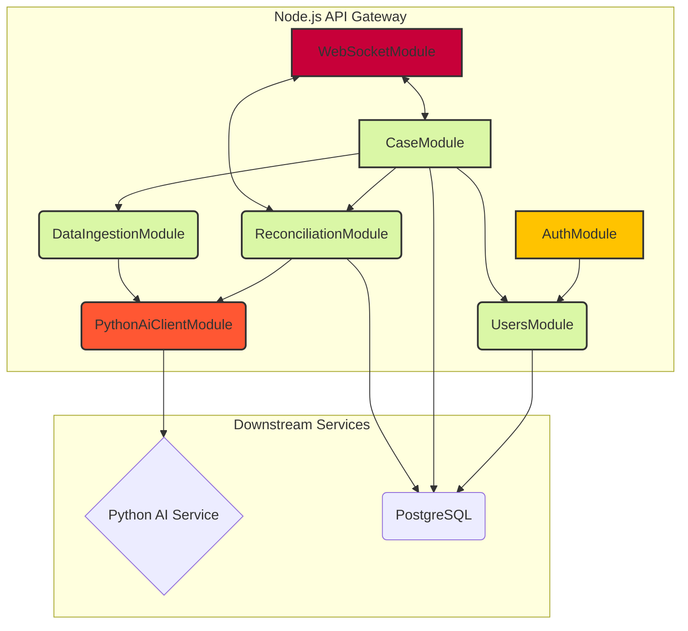

# Node.js API Gateway / BFF Specification

**Version:** 1.0
**Status:** Draft

## 1. Overview

### 1.1. What & Why

This document specifies the design for the **Node.js API Gateway**, which also serves as a **Backend-for-Frontend (BFF)**. Its purpose is to be the single, authoritative entry point for all client applications (initially, the Next.js frontend).

*   **What:** A robust backend service built with **NestJS** (a TypeScript-based Node.js framework).
*   **Why:**
    1.  **Decoupling:** It insulates the frontend from the complexities of the backend microservices. The frontend only needs to know about one API.
    2.  **Security:** It provides a single point for authentication, authorization, and rate limiting, creating a secure perimeter around the internal services.
    3.  **Efficiency:** It can aggregate data from multiple downstream services (e.g., Python AI Service, PostgreSQL) into a single, optimized payload tailored specifically for the UI's needs.
    4.  **Technology Fit:** NestJS provides a structured, modular architecture that is perfect for building scalable and maintainable enterprise-grade applications. Its use of TypeScript aligns with our commitment to static typing.

### 1.2. When (Development Timeline)

*   **Months 1-2:** Setup core application structure, database connections (PostgreSQL, Neo4j, Redis), and configuration management.
*   **Months 2-3:** Implement User & Access Management module, including OAuth 2.0 integration and RBAC logic.
*   **Months 4-5:** Develop the Case Management and Data Ingestion control modules.
*   **Months 6-8:** Build the service clients (gRPC/REST) for communicating with the Python AI service and implement the asynchronous task management logic with RabbitMQ.
*   **Months 9-12:** Performance tuning, security hardening, comprehensive testing, and documentation.

## 2. Core Modules & Responsibilities

The Gateway will be structured using NestJS modules to enforce separation of concerns.

### 2.1. Module Breakdown

*   **`AuthModule`**:
    *   **Responsibility:** Handles all authentication and authorization concerns.
    *   **Functions:**
        *   Integrates with the external OAuth 2.0 provider (e.g., Auth0, Okta).
        *   Validates JWTs on incoming requests.
        *   Implements RBAC (Role-Based Access Control) guards to protect endpoints based on user roles.
        *   Manages user session data.
*   **`CaseModule`**:
    *   **Responsibility:** Manages the lifecycle of forensic cases.
    *   **Functions:**
        *   Provides CRUD operations for `Case` entities.
        *   Handles the business logic for case status transitions.
        *   Orchestrates the initiation of analysis by publishing jobs to the message broker.
*   **`DataIngestionModule`**:
    *   **Responsibility:** Manages the uploading and initial processing of financial documents.
    *   **Functions:**
        *   Provides secure endpoints for file uploads.
        *   Interfaces with file storage service (e.g., S3) to get secure upload URLs.
        *   Triggers the Python AI service (via a message queue) to begin parsing and validation of uploaded files.
*   **`PythonAiClientModule`**:
    *   **Responsibility:** Encapsulates all communication with the downstream Python AI service.
    *   **Functions:**
        *   Provides a strongly-typed client (using gRPC or a REST client with OpenAPI-generated types) for making synchronous requests.
        *   Provides methods for publishing asynchronous jobs to RabbitMQ and handling callbacks or status updates.
*   **`UsersModule`**:
    *   **Responsibility:** Manages user data.
    *   **Functions:**
        *   Provides CRUD operations for `User` entities.
        *   Handles user profile information and preferences.
*   **`MappingsModule`**:
    *   **Responsibility:** Manages user-defined column mapping templates.
    *   **Functions:**
        *   Provides CRUD operations for `ColumnMappingTemplate` entities.
        *   Allows templates to be saved globally or associated with a specific case.
*   **`ReconciliationModule`**:
    *   **Responsibility:** Orchestrates the new, guided reconciliation process.
    *   **Functions:**
        *   Provides an endpoint to initiate a reconciliation job with a specific scope (month, trimester, etc.).
        *   Publishes the `start-reconciliation` job to RabbitMQ.
        *   Listens for real-time `match-result` events from the AI service and broadcasts them to the client via the `WebSocketModule`.
*   **`DiscrepancyModule`**:
    *   **Responsibility:** Manages data quality issues and discrepancies.
    *   **Functions:**
        *   Provides endpoints to list and retrieve discrepancy records for a case.
        *   Allows users to update the status of a discrepancy (e.g., from 'open' to 'resolved').

### 2.2. Module Architecture Diagram



## 3. Functions & Methods (Conceptual)

*   **`AuthGuard`**: A NestJS Guard that will be applied to endpoints. It will inspect the incoming request for a valid JWT, extract user information, and attach it to the request object.
*   **`RolesGuard`**: A parameterizable Guard to restrict access to specific roles (e.g., `@Roles('admin', 'investigator')`).
*   **`CaseService.startAnalysis(caseId: string, userId: string)`**: A service method that performs authorization checks, then creates and publishes a `start-analysis` job to the message queue with the case ID.
*   **`DataIngestionController.getUploadUrl(filename: string, contentType: string)`**: A controller method that returns a pre-signed URL for the client to upload a file directly to S3, preventing large file uploads from tying up the gateway service.
*   **`ReconciliationController.start(caseId: string, payload: StartReconciliationDto)`**: The new controller method to kick off a guided reconciliation job.

## 4. Error Handling

*   **Global Exception Filter:** A global NestJS exception filter will be implemented to catch all unhandled exceptions.
*   **Standardized Error Response:** All errors will be returned in a standardized JSON format:
    ```json
    {
      "statusCode": 404,
      "message": "Case with ID 'xyz' not found",
      "error": "Not Found",
      "timestamp": "2025-07-29T10:00:00.000Z",
      "path": "/api/v1/cases/xyz"
    }
    ```
*   **Specific Exceptions:** Custom exception classes (e.g., `CaseNotFoundException`, `UnauthorizedException`) will be used to provide clear, specific error states.
*   **Logging:** All exceptions will be logged with a unique request ID to correlate logs across services.

## 5. Testing Strategy

*   **Unit Tests (Jest):** Each service method, controller, and guard will be unit-tested in isolation, mocking all dependencies (e.g., database repositories, service clients). Target coverage: **>95%**.
*   **Integration Tests (Jest + Supertest):** Test the full request/response cycle for each module, using an in-memory database or a dedicated test database to ensure modules work together correctly.
*   **E2E Tests (Cypress / Playwright):** While the frontend team will own most E2E tests, the gateway team will be responsible for a suite of API-level E2E tests that validate the entire flow from API request to database state change and message queue publication.

## 6. Input & Output (API Contract)

### 6.1. Intended Input (Frontend Requests)

*   REST or GraphQL requests for data.
*   Authenticated requests containing a JWT in the `Authorization` header.
*   Payloads for creating/updating resources (Cases, Users).
*   Payloads for saving column mappings.

### 6.2. Supposed Output (API Responses & Downstream Calls)

*   **API Responses:** Standardized JSON responses (data or errors) tailored for the frontend.
*   **Downstream Calls (Synchronous):** gRPC or REST calls to the Python AI service for quick lookups or validation.
*   **Downstream Calls (Asynchronous):** Messages published to RabbitMQ to trigger long-running, computationally intensive jobs in the Python service.
    *   **Example Job Payload (`reconciliation.start` queue):**
        ```json
        {
          "jobId": "unique-job-uuid",
          "caseId": "case-uuid-456",
          "fileId": "file-uuid-789",
          "mappingId": "mapping-uuid-abc",
          "scope": "trimester",
          "scopeValue": "Q3",
          "requestedBy": "user-uuid-123",
          "timestamp": "2025-07-29T10:00:00.000Z"
        }
        ```
*   **Upstream Calls (Asynchronous):** The Gateway will listen on a dedicated RabbitMQ queue (e.g., `reconciliation.results`) for real-time match data from the AI service to push to the client.
    *   **Example Result Payload:**
        ```json
        {
          "jobId": "unique-job-uuid",
          "type": "match", // or "unmatch"
          "data": {
            "transactionA": { ... },
            "transactionB": { ... },
            "rationale": "Matched on: Exact Amount & Fuzzy Name (92% confidence)"
          }
        }
        ```

## 7. Current Implementation & Future Improvements

*   **Current Coverage:** This is a new module, so initial coverage is 0%.
*   **Future Improvements:**
    *   **GraphQL Federation:** If the backend grows into more microservices, implement Apollo Federation to expose a single, unified GraphQL data graph to the client.
    *   **WebSockets Gateway:** Implement a NestJS WebSocket gateway to push real-time notifications and progress updates from the backend to the connected clients.
    *   **Advanced Caching:** Implement more sophisticated caching strategies at the gateway level to further reduce load on downstream services.
## 8. Advanced Feature Integration

This section details the API Gateway's role in supporting the advanced features.

### 8.1. Live Operations Dashboard

*   **New Module:** `DashboardModule`
    *   **Responsibility:** Aggregates and serves the data required for the Live Operations Dashboard.
*   **New Module:** `WebSocketModule`
    *   **Responsibility:** Manages the WebSocket server and all real-time communication with the clients.
    *   **Implementation:** Will use the `@nestjs/websockets` package. It will handle client authentication, room management (e.g., each user joins their own private room for targeted updates), and broadcasting events.
*   **Data Flow:**
    1.  The Gateway will listen for "status update" messages from the Python AI Service on a dedicated RabbitMQ queue.
    2.  Upon receiving an update (e.g., job progress, new fraud alert), the `DashboardModule` will process it.
    3.  The `WebSocketModule` will then broadcast the formatted update to the relevant user(s) over the WebSocket connection.

### 8.2. Proactive AI Help System

*   **New Endpoint:** `POST /api/v1/help/context`
    *   **Responsibility:** Receives contextual information from the frontend.
    *   **Action:** This endpoint will not wait for a response. It will publish the context to a `help.context` topic on RabbitMQ for the `HelpAgent` in the Python service to consume asynchronously. The agent's response will be delivered back to the client via the WebSocket.
*   **Input Payload:**
    ```json
    {
      "userId": "user-uuid-123",
      "page": "/cases/case-uuid-456/reconciliation",
      "component": "AdjudicationPanel",
      "timestamp": "2025-07-29T11:00:00.000Z"
    }
    ```

### 8.3. Meta-Design Agent ("App-within-an-App")

*   **New Module:** `MetaDesignModule`
    *   **Responsibility:** Manages all interactions with the `MetaDesignAgent`.
*   **New Endpoint:** `POST /api/v1/meta-design/invoke`
    *   **Responsibility:** Forwards a user's design prompt to the `MetaDesignAgent`.
    *   **Action:** This will be a synchronous request (gRPC or REST) to the Python service, as the user will be actively waiting for the agent's response in a chat-like interface.
*   **MCP Integration:** The Gateway itself does not directly interact with the MCP file system server. It acts as a secure proxy, forwarding requests to the Python service, which is the sole consumer of the MCP tools. This maintains a clear separation of concerns and enhances security.