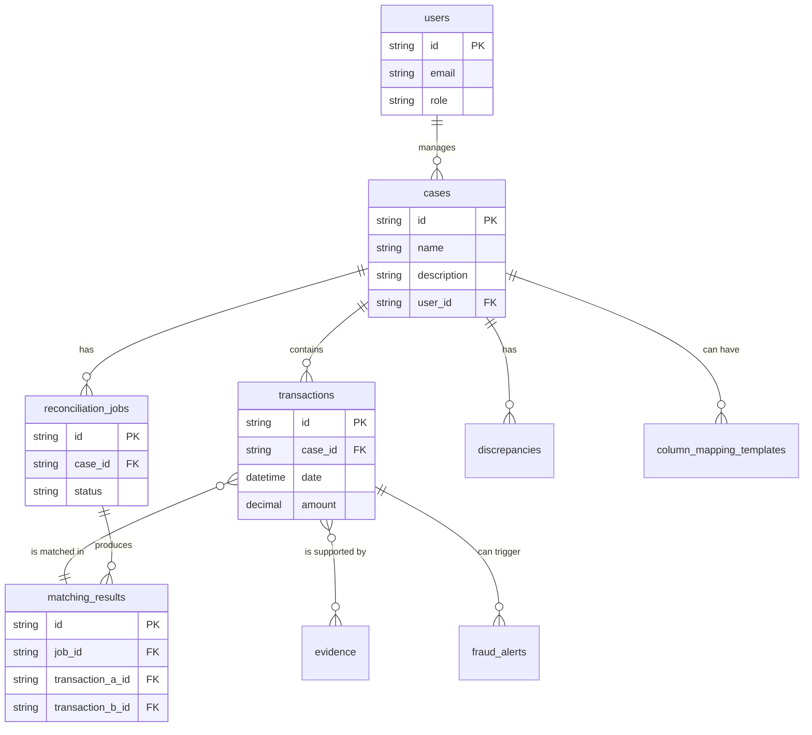

# Data Store Specification

**Version:** 1.0
**Status:** Draft

## 1. Overview

### 1.1. What & Why

This document details the polyglot persistence strategy for the platform. A single database is insufficient to meet the varied data storage and query requirements of this complex system.

*   **What:** A combination of **PostgreSQL** for structured relational data, **Neo4j** for graph-based relationship analysis, and **Redis** for caching and session management.
*   **Why:** This "right tool for the job" approach allows us to leverage the strengths of each database:
    *   **PostgreSQL:** Provides ACID compliance, robust transactional integrity, and a powerful SQL query engine, making it the perfect choice for the core, structured data of the application.
    *   **Neo4j:** Is purpose-built for storing and querying graph data. Its performance in traversing relationships is orders of magnitude faster than recursive SQL joins, which is critical for the platform's core feature of uncovering hidden connections between entities.
    *   **Redis:** Is an in-memory data store that provides extremely low-latency access to data, making it ideal for caching, real-time messaging, and managing user sessions.

## 2. PostgreSQL - Relational Data Store

### 2.1. Responsibilities

*   The "system of record" for core business entities.
*   Storing all transactional data, user information, case details, and audit logs.
*   Enforcing data integrity through constraints and foreign keys.

### 2.2. High-Level Schema (Conceptual Tables)

*   **`users`**: Stores user profile information, credentials (hashed), and roles.
*   **`cases`**: Stores metadata for each forensic case.
*   **`transactions`**: The primary table for all financial transactions.
    *   `id`, `case_id`, `date`, `amount`, `description`, `raw_data` (JSONB), `additional_data` (JSONB), `is_discrepancy` (boolean)
*   **`column_mapping_templates`**: Stores user-defined mapping templates for reuse.
    *   `id`, `user_id`, `case_id` (optional), `template_name`, `mappings` (JSONB)
*   **`reconciliation_jobs`**: Tracks the status of each reconciliation job.
    *   `id`, `case_id`, `file_id`, `mapping_id`, `status`, `scope`, `scope_value`, `results_summary` (JSONB)
*   **`discrepancies`**: Tracks issues found during data ingestion and analysis.
    *   `id`, `case_id`, `type`, `description`, `status`, `data_details` (JSONB)
*   **`evidence`**: Links supporting documents (stored in S3) to cases and transactions.

> **Architectural Note:** The `Discrepancy` model is currently implemented using Mongoose and MongoDB, which deviates from the primary PostgreSQL strategy. This decision was made for rapid prototyping. This should be revisited in the future to align with the specified polyglot persistence strategy, or this document should be updated to reflect a conscious decision to use MongoDB for this specific domain.
*   **`matching_results`**: Stores the output of the reconciliation engine.
    *   `id`, `job_id`, `transaction_a_id`, `transaction_b_id`, `rationale` (text), `confidence_score` (float)
*   **`fraud_alerts`**: Records all alerts generated by the `FraudDetectionEngine`.
*   **`audit_log`**: A comprehensive, immutable log of all significant actions taken within the system.

### 2.3. Entity Relationship Diagram (ERD)

### 2.4. Key Functions & Intended Use

*   The Node.js gateway will perform most of the direct CRUD operations on the `users` and `cases` tables.
*   The Python AI service will be the primary writer to the `transactions`, `matching_results`, and `fraud_alerts` tables.
*   An ORM (Object-Relational Mapper) like **Prisma** (for Node.js) and **SQLAlchemy 2.0** (for Python) will be used to interact with the database in a type-safe manner.

### 2.4. Future Improvements

*   **Read Replicas:** Implement one or more read replicas to scale out read-heavy workloads (like reporting and analytics) without impacting the performance of the primary write database.
*   **Partitioning:** For the `transactions` and `audit_log` tables, implement table partitioning (e.g., by date) to manage data growth and improve query performance on very large datasets.

## 3. Neo4j - Graph Database

### 3.1. Responsibilities

*   Modeling and storing the relationships between financial entities.
*   Powering the interactive graph visualizations in the frontend.
*   Enabling complex pattern matching queries to detect fraud rings, shell corporations, and other collusion-based schemes.

### 3.2. Graph Schema (Nodes & Relationships)

*   **Nodes:**
    *   `:Account`: Represents a bank account.
    *   `:Transaction`: Represents a financial transaction (can also be in PostgreSQL, but key transactions are mirrored here for graph context).
    *   `:Entity`: Represents a person or organization.
    *   `:Address`: A physical address.
    *   `:PhoneNumber`: A phone number.
*   **Relationships:**
    *   `(:Entity)-[:OWNS_ACCOUNT]->(:Account)`
    *   `(:Account)-[:SENT_TRANSACTION]->(:Transaction)`
    *   `(:Transaction)-[:TO_ACCOUNT]->(:Account)`
    *   `(:Entity)-[:HAS_ADDRESS]->(:Address)`
    *   `(:Transaction)-[:MATCHES]->(:Transaction)`
    *   `(:Entity)-[:ASSOCIATED_WITH]->(:Entity)`

### 3.3. Key Functions & Intended Use

*   The Python AI service will be the sole writer to the Neo4j database.
*   After processing a batch of transactions, the AI service will construct a graph representation of the new entities and relationships and update the database.
*   The Node.js gateway will expose endpoints that query Neo4j (using Cypher) to fetch data specifically for the frontend's graph visualizations.

## 4. Redis - In-Memory Cache & Broker

### 4.1. Responsibilities

*   **Session Storage:** Storing user session data for the Node.js gateway.
*   **Application Caching:** Caching frequently accessed, non-critical data (e.g., user permissions, configuration settings) to reduce database load.
*   **Rate Limiting:** Tracking request counts for API rate limiting.
*   **Short-lived Data:** Can be used for temporary storage of job status or real-time notification flags.

### 4.2. Key Functions & Intended Use

*   Both the Node.js and Python services will connect to Redis.
*   The Node.js service will use it heavily for session management and caching data requested by the UI.
*   The Python service might use it to cache intermediate results during a complex analysis pipeline.