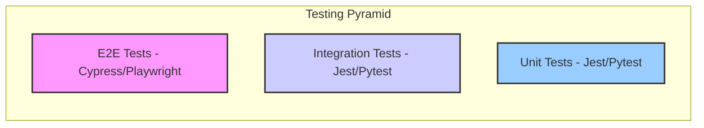

# Comprehensive Testing Strategy

**Version:** 1.0
**Status:** Draft

## 1. Overview

### 1.1. What & Why

This document outlines the comprehensive testing strategy for the entire platform. The strategy is designed to ensure software quality, correctness, and reliability, in accordance with the **Test-First Philosophy** and **100% Deterministic Testing Mandate**.

*   **What:** A multi-layered testing approach, incorporating unit, integration, end-to-end (E2E), and visual regression tests.
*   **Why:** A robust testing pyramid ensures that we can catch bugs early, refactor with confidence, and verify that the system as a whole meets its functional and non-functional requirements. Automated testing is a prerequisite for a reliable CI/CD pipeline and a deployable `main` branch.

## 2. The Testing Pyramid

We will adhere to the principles of the testing pyramid to guide the distribution of our testing efforts.

*   **Unit Tests (Foundation):** The largest number of tests. They are fast, isolated, and verify the smallest pieces of our code (e.g., a single function or React component).
*   **Integration Tests (Middle):** Fewer in number. They test the interaction between multiple components or modules (e.g., a service interacting with a database, an agent calling a tool).
*   **E2E Tests (Peak):** The smallest number of tests. They are slower and more complex, but they validate a complete user workflow through the entire application stack.

## 3. Testing by Service

### 3.1. Frontend (Next.js)

*   **Unit Testing:**
    *   **Tools:** **Vitest** (or Jest) with **React Testing Library**.
    *   **Scope:** Individual React components, hooks, and utility functions.
    *   **Example:** Verify that a `Button` component calls its `onClick` handler when clicked. Verify that the `ColumnMappingInterface` correctly renders input columns.
    *   **Integration Testing:**
        *   **Tools:** React Testing Library.
        *   **Scope:** Test the composition of multiple components within a feature.
        *   **Example:** Test that filling out a form and clicking "submit" correctly calls the API client with the form data. Test the full column mapping flow, from uploading a file to submitting the mappings.
*   **Visual Regression Testing:**
    *   **Tools:** **Storybook** with **Chromatic**.
    *   **Scope:** Capture and compare snapshots of every UI component to prevent unintended visual changes.
*   **E2E Testing:**
    *   **Tools:** **Cypress** or **Playwright**.
    *   **Scope:** Test critical user flows from the browser's perspective.
    *   **Example:** A test that logs in, creates a new case, uploads a file with custom columns, uses the UI to map those columns, and verifies the data is ingested correctly. Another test will verify that a provisional report is generated correctly when a bank statement with a gap is uploaded.

### 3.2. Node.js API Gateway (NestJS)

*   **Unit Testing:**
    *   **Tools:** **Jest**.
    *   **Scope:** Individual services, controllers, and guards, with all external dependencies (databases, clients) mocked.
    *   **Example:** Test that `CaseService.createCase` calls the `caseRepository.save` method. Test that the `MappingService` correctly validates and saves column mappings.
    *   **Integration Testing:**
        *   **Tools:** Jest and **Supertest**.
        *   **Scope:** Test the full request/response cycle for each module, interacting with a real (but test-dedicated) database.
        *   **Example:** Send a `POST` request to `/api/v1/cases` and assert that a new record is created in the test database. Send a `POST` request to the new `/api/v1/cases/:id/mappings` endpoint and verify the mapping is saved correctly.

### 3.3. Python AI Service (FastAPI)

*   **Unit Testing:**
    *   **Tools:** **pytest**.
    *   **Scope:** Individual functions, agent tools, and data processing modules.
    *   **Example:** Test that a specific matching plugin correctly identifies a match between two sample transactions. Test that the `discrepancy_detection` module correctly identifies a gap in a sequence of transactions.
    *   **Integration Testing:**
        *   **Tools:** pytest.
        *   **Scope:** Test the interaction between internal components.
        *   **Example:** Test that a LangGraph agent correctly calls its configured tools in the right sequence based on a given input. Test that the `apply_column_mappings` tool correctly transforms a dataset based on a sample mapping.
*   **API Contract Testing:**
    *   **Tools:** pytest with an HTTP client (e.g., `httpx`).
    *   **Scope:** Test the FastAPI endpoints to ensure they conform to the OpenAPI schema.

## 4. Deterministic Testing Mandate

To ensure all tests are 100% deterministic:

*   **Database State:** All integration and E2E tests must be responsible for their own database state. This will be achieved by:
    1.  Running tests against a dedicated, containerized test database.
    2.  Using a library like `testcontainers` to programmatically start and stop clean database instances for each test suite.
    3.  Seeding the database with a known set of data before each test run and tearing it down afterwards.
*   **Mocking External Services:** All external services (e.g., OAuth provider, S3) must be mocked at the application boundary.
*   **Fixed Timestamps:** Any tests that rely on time will have the system clock mocked to a fixed point in time to ensure consistent results.

## 5. CI/CD Integration

*   All tests (unit and integration) will be run automatically on every commit to a feature branch.
*   A pull request cannot be merged into `main` unless all tests pass with the required code coverage threshold (**approaching 100%**).
*   E2E tests will be run against the staging environment after a successful deployment to staging. A PR will not be cleared for production deployment until all E2E tests pass.